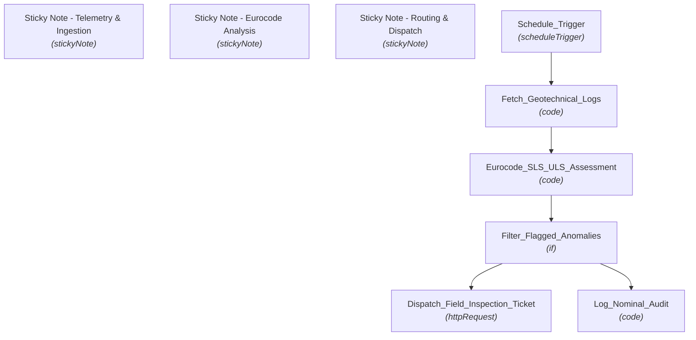

# 🚀 —S—t—r—u—c—t—u—r—a—l— —H—e—a—l—t—h— —M—o—n—i—t—o—r—i—n—g— —&— —C—r—a—c—k— —D—i—s—p—l—a—c—e—m—e—n—t— —D—e—t—e—c—t—i—o—n—

**An end-to-end, enterprise-grade n8n automation workflow.**

[-inactive?style=for-the-badge)](https://n8n.io/)

---

## 📌 Executive Summary

This n8n workflow provides a production-ready automation pipeline for **—S—t—r—u—c—t—u—r—a—l— —H—e—a—l—t—h— —M—o—n—i—t—o—r—i—n—g— —&— —C—r—a—c—k— —D—i—s—p—l—a—c—e—m—e—n—t— —D—e—t—e—c—t—i—o—n—**. It ingests incoming data, processes payloads through configured logic nodes, and routes insights/alerts across downstream channels.

---

## ⚡ Key Capabilities

* **🔄 End-to-End Automation:** Streamlines multi-step data processing and triggers actions automatically.
* **🧠 Intelligent Data Handling:** Integrates specialized nodes for data transformation, conditional evaluation, and API communication.
* **🚨 Real-Time Monitoring & Dispatch:** Ensures rapid incident response and data sync across connected systems.
* **📊 Scalable & Modular Architecture:** Built with n8n best practices for error handling, modularity, and high throughput.

---

## 📌 System Architecture & Process Flow

---

## 📂 Node Inventory & Pipeline Components

| # | Node Name | Type | Disabled |
|---|---|---|:---:|
| 1 | **Sticky Note - Telemetry & Ingestion** | `stickyNote` | No |
| 2 | **Sticky Note - Eurocode Analysis** | `stickyNote` | No |
| 3 | **Sticky Note - Routing & Dispatch** | `stickyNote` | No |
| 4 | **Schedule_Trigger** | `scheduleTrigger` | No |
| 5 | **Fetch_Geotechnical_Logs** | `code` | No |
| 6 | **Eurocode_SLS_ULS_Assessment** | `code` | No |
| 7 | **Filter_Flagged_Anomalies** | `if` | No |
| 8 | **Dispatch_Field_Inspection_Ticket** | `httpRequest` | No |
| 9 | **Log_Nominal_Audit** | `code` | No |

---

## ⚙️ Setup & Deployment Instructions

### 1. Import Workflow Blueprint
1. Download the [`workflow.json`](./workflow.json) file from this repository.
2. Open your **n8n instance**.
3. Click **Workflows** -> **Import from File**.
4. Select `workflow.json`.

### 2. Configure Credentials & Environment
* Set up required API tokens, webhooks, or database credentials for any integrated service nodes.
* Ensure relevant environment variables or global variables referenced in Code/HTTP nodes are populated in your n8n settings.

### 3. Activate Pipeline
* Toggle the workflow status to **Active** to begin live execution.

---

## 🤝 Contribution & Maintenance

Contributions, improvements, and bug fixes are welcome! Feel free to open an issue or submit a pull request.

---

## 📄 License

This project is licensed under the [MIT License](LICENSE).
