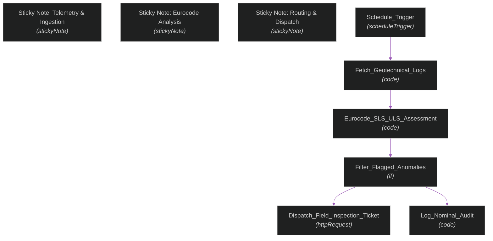

<div align="center">

<br/>

```
   _______________  __  ________________  ______  ___    __ 
  / ___/_  __/ __ \/ / / / ____/_  __/ / / / __ \/   |  / / 
  \__ \ / / / /_/ / / / / /     / / / / / / /_/ / /| | / /  
 ___/ // / / _, _/ /_/ / /___  / / / /_/ / _, _/ ___ |/ /___
/____//_/ /_/ |_|\____/\____/ /_/  \____/_/ |_/_/  |_/_____/
```

<h3>Structural Health & Crack Displacement Monitor</h3>

<br/>

[](https://n8n.io/)
[](https://n8n.io/)
[](https://n8n.io/)
[](LICENSE)
[](http://makeapullrequest.com)

<br/>

[**Quick Start**](#-installation) | [**Architecture**](#-architecture) | [**Node Inventory**](#-node-inventory) | [**Usage**](#-usage-examples)

<br/>

</div>

---

## What is this?

An automated n8n workflow for **Structural Health & Crack Displacement Monitor**. It processes incoming events, transforms data payloads, and handles conditional dispatch to downstream services.

| | Component | Purpose |
|---|---|---|
| **📥** | **Sticky Note - Telemetry & Ingestion** | Ingests incoming webhooks or scheduled telemetry payloads |
| **🧠** | **Sticky Note - Eurocode Analysis** | Evaluates logic conditions and enriches message data |
| **🚨** | **Sticky Note - Routing & Dispatch** | Dispatches notifications and updates database records |

---

## 📑 Table of Contents

- [Architecture](#-architecture)
- [Core Features](#-core-features)
- [Tech Stack](#-tech-stack)
- [Prerequisites](#-prerequisites)
- [Installation](#-installation)
- [Node Inventory](#-node-inventory)
- [Usage Examples](#-usage-examples)
- [Project Structure](#-project-structure)
- [Contributing](#-contributing)
- [License](#-license)

---

## 🏗 Architecture



---

## ✦ Core Features

<table>
<tr>
<td width="50%" valign="top">

**📡 &nbsp;Event-Driven Triggering**  
Supports incoming webhooks and scheduled cron jobs for automatic background processing.

---

**⚡ &nbsp;Data Normalization**  
Standardizes raw input fields before forwarding payloads to analytics databases.

---

**🔒 &nbsp;Error Handling**  
Catches execution exceptions to prevent failed runs from stopping pipeline flow.

</td>
<td width="50%" valign="top">

**🧠 &nbsp;Conditional Logic**  
Filters high-priority alerts so team members only receive urgent notifications.

---

**📊 &nbsp;System Synchronization**  
Keeps external databases, logs, and notification channels in sync.

---

**🔌 &nbsp;Easy Import**  
Import the blueprint JSON directly into your n8n workspace to get started.

</td>
</tr>
</table>

---

## 🔧 Tech Stack

| Layer | Technology | Purpose |
|---|---|---|
| Orchestration | [n8n](https://n8n.io/) | Workflow engine, cron scheduling, webhook routing |
| Execution Engine | Node.js / JavaScript | Payload parsing and custom data mapping |
| Transport Protocol | Webhook / REST APIs | API requests and notification delivery |
| Blueprint Format | JSON (n8n v1+) | Portable workflow definition file |

---

## ✅ Prerequisites

- **n8n instance** (self-hosted or [n8n Cloud](https://app.n8n.cloud))
- Relevant API credentials configured inside your n8n workspace

---

## ⚙️ Installation

### 1. Import the Workflow

```
Workflows -> Import from File -> workflow.json
```

### 2. Configure Credentials

```
+---------------------+-------------------+--------------------------------------+
| Credential          | Type              | Attach To                            |
+---------------------+-------------------+--------------------------------------+
| API / Webhook Keys  | HTTP / OAuth2     | Integration Nodes                    |
+---------------------+-------------------+--------------------------------------+
```

### 3. Activate Workflow

```
Workflows -> [Structural Health & Crack Displacement Monitor] -> Toggle Active
```

---

## 📑 Node Inventory

| # | Node Name | Type | Status |
|---|---|---|:---:|
| `01` | **Sticky Note - Telemetry & Ingestion** | `stickyNote` | Active |
| `02` | **Sticky Note - Eurocode Analysis** | `stickyNote` | Active |
| `03` | **Sticky Note - Routing & Dispatch** | `stickyNote` | Active |
| `04` | **Schedule_Trigger** | `scheduleTrigger` | Active |
| `05` | **Fetch_Geotechnical_Logs** | `code` | Active |
| `06` | **Eurocode_SLS_ULS_Assessment** | `code` | Active |
| `07` | **Filter_Flagged_Anomalies** | `if` | Active |
| `08` | **Dispatch_Field_Inspection_Ticket** | `httpRequest` | Active |
| `09` | **Log_Nominal_Audit** | `code` | Active |

---

## 🧪 Usage Examples

### cURL: Trigger Webhook

```bash
curl -X POST https://your-n8n-instance.com/webhook/structural-health-monitoring-crack-detection \
  -H "Content-Type: application/json" \
  -d '{"timestamp": "2026-09-15T12:00:00Z", "event": "HEALTH_CHECK"}'
```

### Python: Send Event

```python
import requests

url = "https://your-n8n-instance.com/webhook/structural-health-monitoring-crack-detection"
payload = {"event": "HEALTH_CHECK", "source": "python_script"}

res = requests.post(url, json=payload)
print("Response code:", res.status_code)
print("Data:", res.json())
```

---

## 📂 Project Structure

```
structural-health-monitoring-crack-detection/
├── workflow.json      # Complete importable workflow definition
├── LICENSE            # MIT License file
└── README.md          # Project documentation
```

---

## 🤝 Contributing

Pull requests and issues are welcome.

```bash
# 1. Clone the repository
git clone https://github.com/abderrahman-ai/structural-health-monitoring-crack-detection.git

# 2. Create your branch
git checkout -b patch/improvements

# 3. Commit your changes
git commit -m "docs: refine workflow description and node names"

# 4. Push to origin
git push origin patch/improvements
```

---

## 📄 License

Released under the **MIT License**. Check [`LICENSE`](LICENSE) for full details.

---

<div align="center">

<br/>

Built with [n8n](https://n8n.io/)

<br/>

**[Back to top](#)**

</div>
